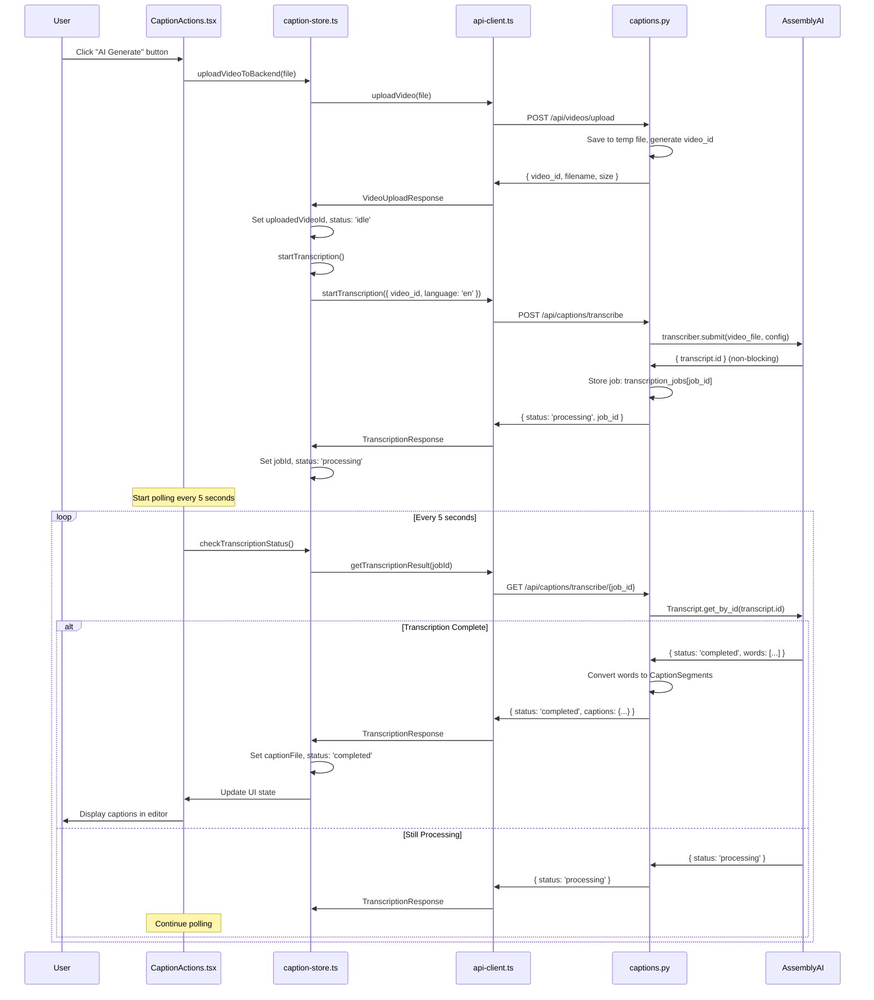

# AI Caption Generation Flow Analysis

## Overview

This document provides a comprehensive analysis of the current end-to-end flow for AI caption generation in the Caption Editor application, from user interaction to caption display. This analysis is intended to help developers understand the current implementation and guide future modularization and SOLID principle improvements.

## Current Architecture Summary

The current AI generation system follows a **tightly coupled, direct integration** approach:

- **Frontend**: React components directly call Zustand store actions
- **Store**: Zustand store directly calls API client methods
- **Backend**: FastAPI directly integrates with AssemblyAI SDK
- **No abstraction layers** for different AI providers
- **Hard-coded AssemblyAI logic** throughout the system

## End-to-End Flow Analysis

### 1. User Clicks "AI Generate" Button

**Location**: `packages/web-ui/src/components/CaptionActions.tsx:210`

```tsx
<Button
  onClick={handleAITranscription}
  disabled={
    !hasVideo ||
    transcription.status === "uploading" ||
    transcription.status === "processing"
  }
  variant="outline"
>
  {transcription.status === "uploading" ||
  transcription.status === "processing" ? (
    <Loader2 className="w-4 h-4 mr-2 animate-spin" />
  ) : (
    <Sparkles className="w-4 h-4 mr-2" />
  )}
  AI Generate
</Button>
```

### 2. Frontend Initiates AI Transcription Process

**Function**: `CaptionActions.tsx:114` - `handleAITranscription()`

```tsx
const handleAITranscription = useCallback(async () => {
  if (!video.file || !video.fileName) {
    alert("Please upload a video first");
    return;
  }

  try {
    // Clear any previous transcription state
    clearTranscriptionState();

    // Step 1: Upload video file to backend
    await uploadVideoToBackend(video.file);

    // Step 2: Start transcription (uploadVideoToBackend sets uploadedVideoId)
    await startTranscription();
  } catch (error) {
    // Error handling
  }
}, [
  video.file,
  video.fileName,
  uploadVideoToBackend,
  startTranscription,
  clearTranscriptionState,
]);
```

**Dependencies**:

- `video.file`: Original File object from video upload
- `video.fileName`: Display name for the video
- Store actions: `clearTranscriptionState`, `uploadVideoToBackend`, `startTranscription`

### 3. Video Upload to Backend

**Store Action**: `packages/web-ui/src/stores/caption-store.ts:580` - `uploadVideoToBackend()`

```typescript
uploadVideoToBackend: async (file: File) => {
  try {
    set((state) => ({
      transcription: {
        ...state.transcription,
        status: "uploading",
        error: null,
      },
    }));

    const response = await apiClient.uploadVideo(file);

    set((state) => ({
      uploadedVideoId: response.video_id,
      transcription: { ...state.transcription, status: "idle" },
    }));
  } catch (error) {
    // Error handling
  }
};
```

**API Call**: `packages/web-ui/src/utils/api-client.ts:41` - `ApiClient.uploadVideo()`

```typescript
async uploadVideo(file: File): Promise<VideoUploadResponse> {
  const formData = new FormData();
  formData.append('file', file);

  const response = await fetch(`${API_BASE_URL}/videos/upload`, {
    method: 'POST',
    body: formData,
  });

  return response.json();
}
```

**Backend Endpoint**: `packages/api-server/src/caption_editor_api/routers/captions.py:67`

```python
@router.post("/videos/upload", response_model=VideoUploadResponse)
async def upload_video(file: UploadFile = File(...)):
    # Validate file extension (.mp4, .mov, .m4v)
    # Create temporary file
    # Store file path mapping: video_files[video_id] = temp_file_path
    # Return video_id for transcription
```

### 4. Start AI Transcription

**Store Action**: `caption-store.ts:625` - `startTranscription()`

```typescript
startTranscription: async (videoId?: string, videoUrl?: string) => {
  try {
    const state = get();
    const requestVideoId = videoId || state.uploadedVideoId;

    set((state) => ({
      transcription: { ...state.transcription, status: "processing" },
    }));

    const response = await apiClient.startTranscription({
      video_id: requestVideoId || undefined,
      video_url: videoUrl,
      language: "en",
    });

    set((state) => ({
      transcription: { ...state.transcription, jobId: response.job_id },
    }));
  } catch (error) {
    // Error handling
  }
};
```

**API Call**: `api-client.ts:61` - `ApiClient.startTranscription()`

```typescript
async startTranscription(request: TranscriptionRequest): Promise<TranscriptionResponse> {
  const response = await fetch(`${API_BASE_URL}/captions/transcribe`, {
    method: 'POST',
    headers: { 'Content-Type': 'application/json' },
    body: JSON.stringify(request),
  });
  return response.json();
}
```

**Backend Processing**: `captions.py:125` - `transcribe_video()`

```python
@router.post("/captions/transcribe", response_model=TranscriptionResponse)
async def transcribe_video(request: TranscriptionRequest):
    # Initialize AssemblyAI transcriber
    transcriber = aai.Transcriber()

    # Configure transcription
    config = aai.TranscriptionConfig(
        language_detection=True,
        punctuate=True,
        format_text=True
    )

    # Submit transcription job (non-blocking)
    transcript = transcriber.submit(str(video_source), config=config)

    # Store job info for polling: transcription_jobs[job_id] = {...}
    return TranscriptionResponse(status="processing", job_id=job_id, ...)
```

### 5. Polling for Results

**Frontend Polling**: `CaptionActions.tsx:150` - `useEffect` hook

```tsx
useEffect(() => {
  let pollInterval: NodeJS.Timeout;

  if (transcription.status === "processing" && transcription.jobId) {
    pollInterval = setInterval(async () => {
      try {
        await checkTranscriptionStatus();
      } catch (error) {
        clearInterval(pollInterval);
      }
    }, 5000); // Poll every 5 seconds
  }

  return () => {
    if (pollInterval) clearInterval(pollInterval);
  };
}, [transcription.status, transcription.jobId, checkTranscriptionStatus]);
```

**Store Action**: `caption-store.ts:683` - `checkTranscriptionStatus()`

```typescript
checkTranscriptionStatus: async () => {
  try {
    const state = get();
    const response = await apiClient.getTranscriptionResult(
      state.transcription.jobId,
    );

    if (response.status === "completed" && response.captions) {
      // Convert API response to CaptionFile format
      const captionFile: CaptionFile = {
        segments: response.captions.segments.map((seg: any) => ({
          id: seg.id,
          startTime: seg.start_time,
          endTime: seg.end_time,
          text: seg.text,
        })),
        // ... metadata
      };

      set({
        captionFile,
        transcription: { status: "completed", jobId: null, error: null },
      });
    }
  } catch (error) {
    // Error handling
  }
};
```

**Backend Status Check**: `captions.py:179` - `get_transcription_result()`

```python
@router.get("/captions/transcribe/{job_id}", response_model=TranscriptionResponse)
async def get_transcription_result(job_id: str):
    # Get job from memory store: transcription_jobs[job_id]
    # Check AssemblyAI status: aai.Transcript.get_by_id(transcript.id)

    if current_transcript.status == aai.TranscriptStatus.completed:
        # Convert AssemblyAI words to CaptionSegments
        # Group words into logical segments (max 5 seconds, break on punctuation)
        segments = []
        for word in current_transcript.words:
            # Smart segmentation logic...

        return TranscriptionResponse(
            status="completed",
            captions=CaptionFile(segments=segments),
            message="Transcription completed successfully"
        )
```

### 6. Caption Display and Integration

**Automatic UI Update**: When `checkTranscriptionStatus()` sets `captionFile` in the store, the UI automatically updates:

- **CaptionEditor Component** (`CaptionEditor.tsx:24`): Subscribes to `captionFile` from store
- **Real-time Rendering**: Segments automatically appear in the editor
- **Video Synchronization**: Captions are immediately synchronized with video playback

## Source Files and Functions Involved

### Frontend Components

1. **CaptionActions.tsx**
   - `handleAITranscription()`: Entry point for AI generation
   - `useEffect()`: Polling mechanism for transcription status
   - UI state management for button states and status messages

2. **CaptionEditor.tsx**
   - Consumes `captionFile` from store for display
   - Provides segment editing capabilities after AI generation

### State Management

3. **caption-store.ts**
   - `uploadVideoToBackend()`: Handles video file upload
   - `startTranscription()`: Initiates AI transcription job
   - `checkTranscriptionStatus()`: Polls for transcription results
   - `clearTranscriptionState()`: Resets transcription state
   - Transcription state: `{ jobId, status, error }`

### API Layer

4. **api-client.ts**
   - `uploadVideo()`: POST `/api/videos/upload`
   - `startTranscription()`: POST `/api/captions/transcribe`
   - `getTranscriptionResult()`: GET `/api/captions/transcribe/{job_id}`

### Backend Services

5. **captions.py**
   - `upload_video()`: Video file handling and storage
   - `transcribe_video()`: AssemblyAI integration and job creation
   - `get_transcription_result()`: Status checking and result conversion
   - In-memory stores: `transcription_jobs`, `video_files`

### Type Definitions

6. **Common Types** (`packages/common-types/`)
   - `TranscriptionRequest`: API request schema
   - `TranscriptionResponse`: API response schema
   - `CaptionFile`, `CaptionSegment`: Core data models

## Sequence Diagram



## Key Design Issues for Modularization

### 1. **Tight Coupling**

- Store directly imports and calls `apiClient`
- Backend directly imports and uses AssemblyAI SDK
- No abstraction for different AI providers

### 2. **Violation of Single Responsibility Principle**

- `caption-store.ts`: Handles UI state, API calls, AND data transformation
- `captions.py`: Handles file upload, transcription logic, AND result formatting

### 3. **Hard-coded Dependencies**

- AssemblyAI SDK directly imported in backend
- API endpoints hard-coded in frontend
- No configuration for different AI providers

### 4. **No Plugin System**

- Cannot easily swap AI providers
- No standardized interface for transcription services
- Provider-specific logic scattered throughout codebase

### 5. **Limited Error Handling**

- Basic try/catch blocks
- No retry logic for failed transcriptions
- No graceful degradation

## Recommendations for SOLID Compliance

### 1. **Single Responsibility Principle (SRP)**

```typescript
// Separate concerns into distinct classes
class TranscriptionService // Handle only transcription logic
class VideoUploadService  // Handle only video upload
class ResultPollingService // Handle only status polling
```

### 2. **Open/Closed Principle (OCP)**

```typescript
interface AITranscriptionProvider {
  uploadVideo(file: File): Promise<string>;
  startTranscription(videoId: string): Promise<string>;
  getTranscriptionStatus(jobId: string): Promise<TranscriptionResult>;
}

// Providers: AssemblyAIProvider, OpenAIWhisperProvider, GoogleSpeechProvider
```

### 3. **Liskov Substitution Principle (LSP)**

- All AI providers should be interchangeable
- Same interface, consistent behavior

### 4. **Interface Segregation Principle (ISP)**

```typescript
interface VideoUploader {
  uploadVideo(file: File): Promise<string>;
}

interface TranscriptionStarter {
  startTranscription(videoId: string): Promise<string>;
}

interface StatusChecker {
  checkStatus(jobId: string): Promise<TranscriptionStatus>;
}
```

### 5. **Dependency Inversion Principle (DIP)**

```typescript
class TranscriptionOrchestrator {
  constructor(
    private uploader: VideoUploader,
    private transcriber: TranscriptionStarter,
    private statusChecker: StatusChecker,
  ) {}
}
```

This analysis provides the foundation for implementing a more modular, SOLID-compliant architecture that supports multiple AI providers through a plugin system.
